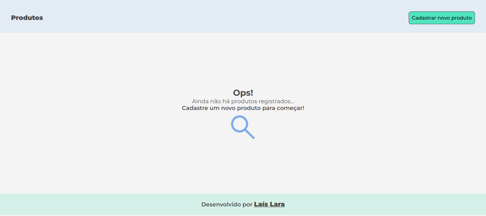
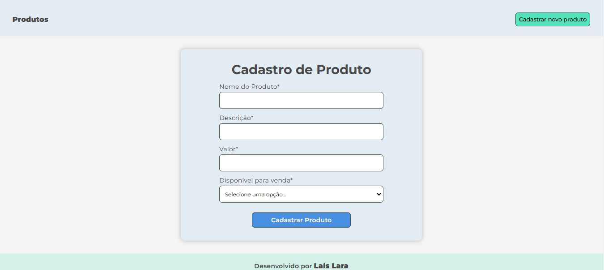
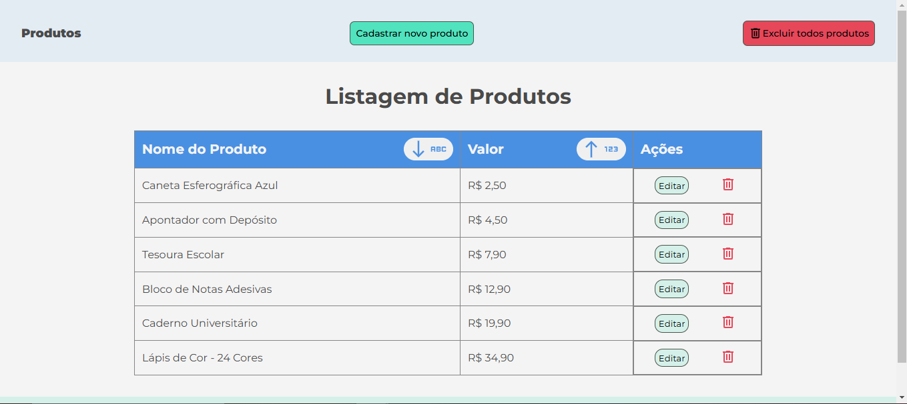
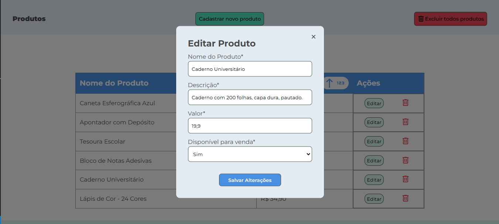
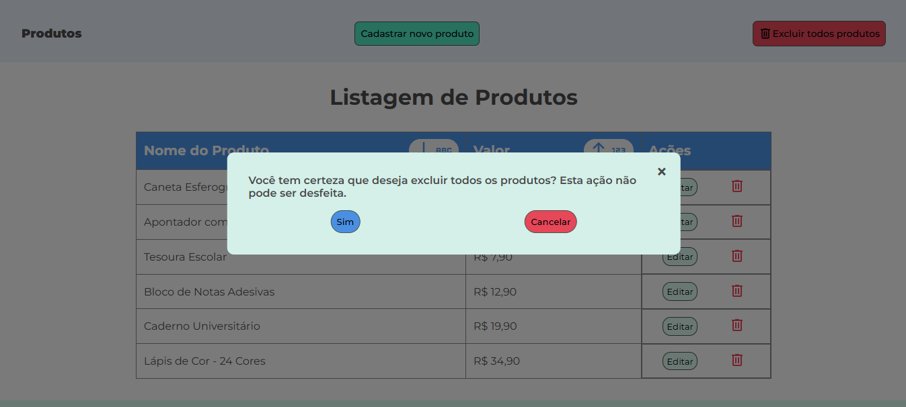
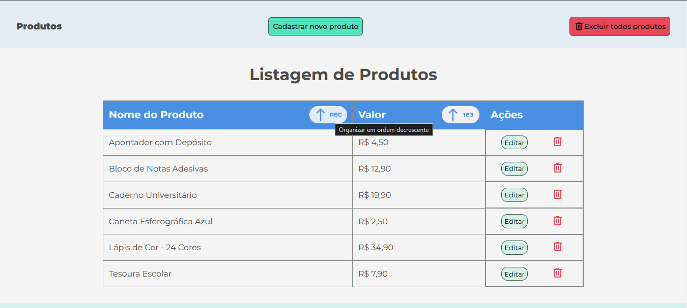

# Sistema de Listagem e Cadastro de Produtos

Este é um projeto de listagem e cadastro de produtos desenvolvido com **HTML**, **CSS** e **JavaScript**. O sistema permite ao usuário cadastrar, listar, organizar, editar e excluir produtos de forma simples e intuitiva.

## Funcionalidades  

- 📋 **Cadastro de Produtos**: Permite adicionar produtos com informações como nome, descrição, preço e se está disponível para venda ou não.  
- 📄 **Listagem de Produtos**: Exibe os produtos cadastrados em uma tabela organizada.
- 🗄️ **Organização de Produtos**: Possibilidade de reorganizar a listagem de produtos em ordem crescente ou decrescente dos nomes ou dos preços.
- ✏️ **Edição de Produtos**: Possibilidade de atualizar os dados de um produto cadastrado.  
- 🗑️ **Exclusão de Produtos**: Remoção de produtos da lista com facilidade.

## Tecnologias Utilizadas  

- **HTML5**: Estruturação do conteúdo.
- **CSS3**: Estilização do layout e responsividade. 
- **JavaScript**: Lógica de interação e manipulação dos dados.

## Capturas de Tela

### Tela Inicial
Tela inicial quando ainda não há produtos cadastrados no sistema, caso tenha cadastros realizados, a tela inicial se torna a própria listagem.

### Formulário de Cadastro

### Listagem de Produtos
Na listagem dos produtos, são exibidas apenas as informações do nome e do valor. Além disso, o usuário pode editar todas as informações do cadastro clicando em "editar" que está na mesma linha das informações, ou então, pode excluir apenas um produto clicando no ícone de lixeira que está posicionado junto ao botão de editar.

### Edição de Produto Cadastrado
Modal que é exibido para o usuário quando ele clica no botão "editar" de algum produto cadastrado.

### Mensagem Exclusão de Todos os Produtos
Mensagem que é exibida para o usuário quando ele clica no botão "excluir todos produtos" que está presente no cabeçalho da tela. Ao confirmar esta opção, todos os produtos são excluídos de uma única vez.

### Reorganizações
A listagem de produtos é sempre organizada na ordem crescente dos valores. Porém, o usuário também tem as opções de reorganizar a listagem nas ordens crescente e decrescente dos nomes e dos preços.

Desenvolvido por [Laís Lara](https://github.com/Lais-lfs/).